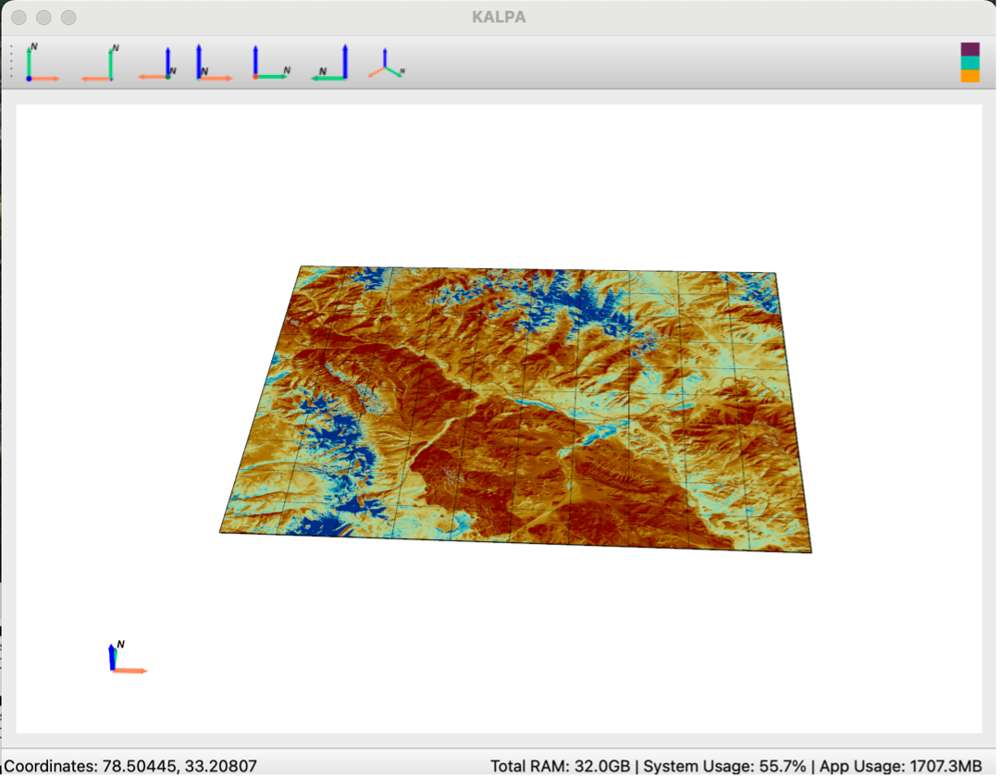
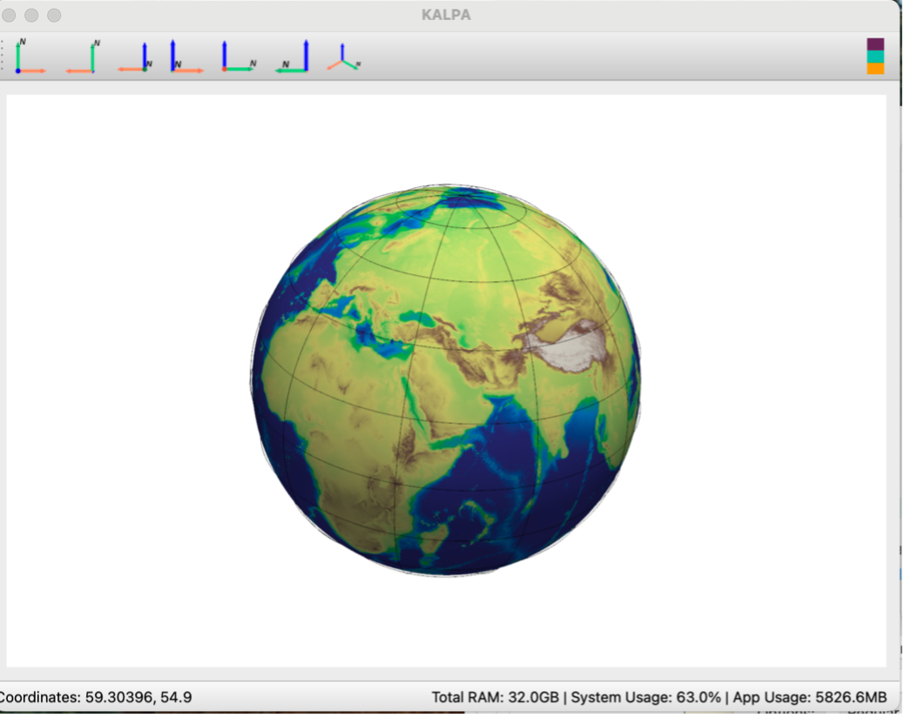

Projections
===========

Kalpa supports two types of projections: 

3D Cartesian Projection 
----------------------------
- This projection allows you to visualize data on a flat Cartesian plane.
- Surface raster and vector data are placed at a reference plane set 6,371,000 meters (the approximate radius of the Earth) from the Earth's center.
- This setup is particularly useful for analyzing global and regional datasets, especially when working with volumetric rasters.

3D Spherical Projection 
----------------------------
- This option lets you visualize raster and vector data in a spherical projection. 
- It is ideal for datasets with a global extent, enabling a more natural representation of Earth's surface curvature. 

